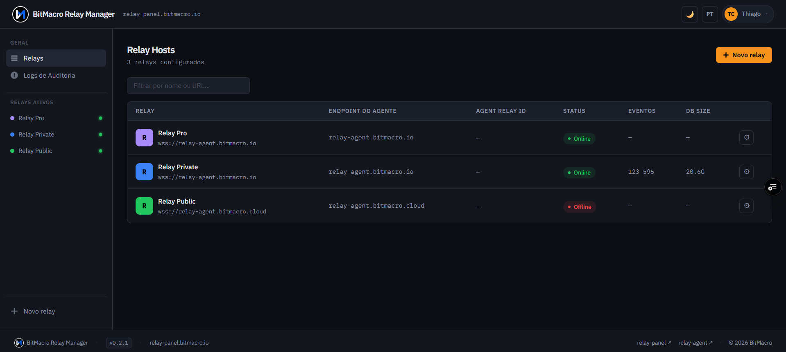

# BitMacro Relay Manager — relay-panel

[](https://github.com/bitmacro/relay-panel/actions/workflows/ci.yml)
[](https://github.com/bitmacro/relay-panel/releases)
[](LICENSE)
[](https://nextjs.org/)
[](https://react.dev/)
[](https://www.typescriptlang.org/)
[](https://tailwindcss.com/)
[](https://nodejs.org/)
[](https://authjs.dev/)
[](https://github.com/nbd-wtf/nostr-tools)
[](https://vercel.com/)
[](https://www.npmjs.com/package/@bitmacro/relay-connect)
[](https://www.npmjs.com/package/@bitmacro/relay-agent)

**[→ Web UI: relay-panel.bitmacro.io](https://relay-panel.bitmacro.io)**  
**[→ BitMacro Ecosystem: bitmacro.io](https://bitmacro.io)**

**Manage your Nostr relay without touching the terminal.**

Web UI for the [BitMacro Relay Manager](https://relay-panel.bitmacro.io) ecosystem. Visual dashboard for relay operators — moderation, access control, Lightning payments and multi-relay management in one panel.

🔗 **[relay-panel.bitmacro.io](https://relay-panel.bitmacro.io)** — landing + sign in with GitHub

---

## Screenshot



*Relay Hosts table with status badges, sidebar navigation, and relay management.*

---

## What it does

| Feature | Description |
|---------|-------------|
| **Visual Dashboard** | Events, DB size, uptime, activity by kind |
| **Access Control** | Whitelist (toggle off → `DELETE` allow), event publishers, **Blocked** list (`GET policy/blocked`, **Unblock** → `DELETE` block); kind 0 profiles (name, avatar, NIP-05, lud16/LNURL), search & pagination |
| **Lightning Payments** | Automatic access after payment, LNbits webhook |
| **Multi-relay** | Manage N relays from one agent instance |
| **GitHub Auth** | NextAuth.js v5, no passwords |

---

## Routing

| Path | Description |
|------|-------------|
| `/` | Landing page (public) |
| `/auth/signin` | Sign in with GitHub |
| `/relays` | Dashboard — relay table (protected) |
| `/relays/[id]` | Relay detail — Dashboard, Eventos, Acesso, Config (protected) |

---

## Stack

- Next.js 16 (App Router, Turbopack)
- React 19
- Tailwind CSS v4 + shadcn/ui
- NextAuth.js v5 (GitHub)

---

## Setup

```bash
cp .env.example .env.local
# Edit .env.local with required values

npm install
npm run dev
```

### Required environment variables

| Variable | Description |
|----------|-------------|
| `NEXTAUTH_SECRET` | Secret for JWT signing (min 32 chars, e.g. `openssl rand -base64 32`) |
| `NEXTAUTH_URL` | App URL (e.g. `http://localhost:3000`) |
| `NEXT_PUBLIC_API_URL` | relay-api base URL (e.g. `https://relay-api.bitmacro.io`) |
| `GITHUB_CLIENT_ID` | GitHub OAuth App client ID |
| `GITHUB_CLIENT_SECRET` | GitHub OAuth App client secret |
| `RELAY_API_KEY` | API key shared with relay-api |
| `RELAY_API_URL` | (Optional) Server-side relay-api base URL; defaults to `NEXT_PUBLIC_API_URL`. Use if PATCH/config timeouts suggest a different Vercel region than the browser URL |

---

## Repository layout

| Path | Role |
|------|------|
| `src/app/api/` | Next.js routes that proxy to relay-api (`X-API-Key`, `X-Provider-User-Id`) |
| `src/components/` | UI (dashboard, relay tabs, landing, layout) |
| `src/lib/api.ts` | `apiUrl()` — builds relay-api paths from env |
| `src/lib/auth.ts` | NextAuth; `session.user.id` = GitHub provider id |
| `src/lib/relay-pubkey.ts` | 64-char hex validation for `policy/*/ [pubkey]` routes |

### Policy API routes (`/api/relay/[id]/policy/*`)

Proxied to relay-api with the same headers as other `/api/relay/*` routes.

| Panel route | Method | Upstream |
|-------------|--------|----------|
| `/api/relay/[id]/policy` | GET | `GET /relay/:id/policy` |
| `/api/relay/[id]/policy/blocked` | GET | `GET /relay/:id/policy/blocked` |
| `/api/relay/[id]/policy/allow` | POST | `POST /relay/:id/policy/allow` |
| `/api/relay/[id]/policy/allow/[pubkey]` | DELETE | `DELETE /relay/:id/policy/allow/:pubkey` (invalid pubkey → **400** from panel) |
| `/api/relay/[id]/policy/block` | POST | `POST /relay/:id/policy/block` |
| `/api/relay/[id]/policy/block/[pubkey]` | DELETE | `DELETE /relay/:id/policy/block/:pubkey` |

HTTP status from relay-api is forwarded (including **404** on DELETE).

---

## Architecture

The panel **never** talks directly to relay-agents or Supabase. All logic goes through relay-api:

```
relay-panel (this repo)
    │  /api/* → proxy with X-API-Key + X-Provider-User-Id
    ▼
relay-api (Vercel, Supabase)
    │  REST + Bearer JWT
    ▼
relay-agent (runs on your server)
    │  strfry CLI / LMDB
    ▼
Nostr relay (strfry)
```

That diagram is the path for **this repository**: the panel only talks to **relay-api**, which proxies to **relay-agent**.

For the **full BitMacro Relay Manager topology** (marketing site → relay-connect-web → relay-api → relay-agent), including **NIP-07** and **NIP-46** authentication flows, see **[bitmacro.io/relay-manager/docs](https://bitmacro.io/relay-manager/docs)**.

---

## Ecosystem

| Project | Description | License |
|---------|-------------|---------|
| [relay-agent](https://github.com/bitmacro/relay-agent) | REST API agent for strfry | MIT |
| [@bitmacro/relay-connect](https://github.com/bitmacro/relay-connect) | BitMacro Connect SDK | MIT |
| [relay-connect-web](https://github.com/bitmacro/relay-connect-web) | Connect UI (NIP-46 / NIP-07) | MIT |
| [relay-api](https://github.com/bitmacro/relay-api) | Central hub (Supabase, proxy) | Private |
| **relay-panel** | This repo — frontend | BSL 1.1 |

---

## Deploy

[](https://vercel.com/new/clone?repository-url=https://github.com/bitmacro/relay-panel)

---

## Related

- **[Technical documentation (full stack)](https://bitmacro.io/relay-manager/docs)** — ecosystem from bitmacro.io to relay-agent; **NIP-07** and **NIP-46**
- [relay-panel](https://relay-panel.bitmacro.io) — Web UI for relay operators (BSL 1.1)
- [relay-api](https://github.com/bitmacro/relay-api) — Central API hub (private)
- [BitMacro](https://bitmacro.io) — Bitcoin, Lightning & Nostr ecosystem

---

## Contributing

See [CONTRIBUTING.md](CONTRIBUTING.md) for setup and PR guidelines.

---

## License

Business Source License 1.1 (BSL-1.1). See [LICENSE](LICENSE).
